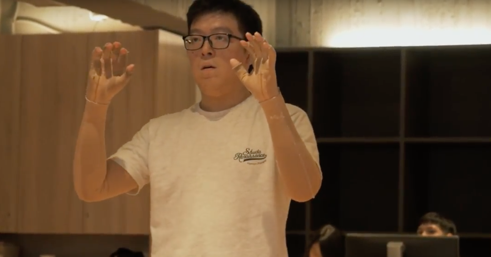
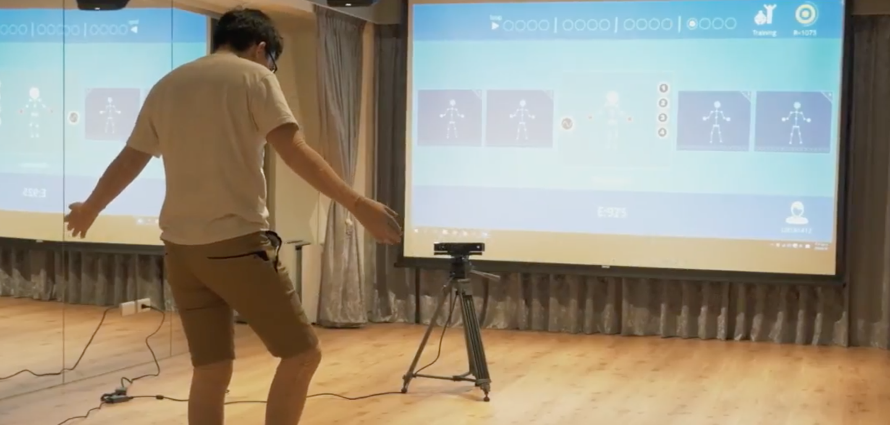
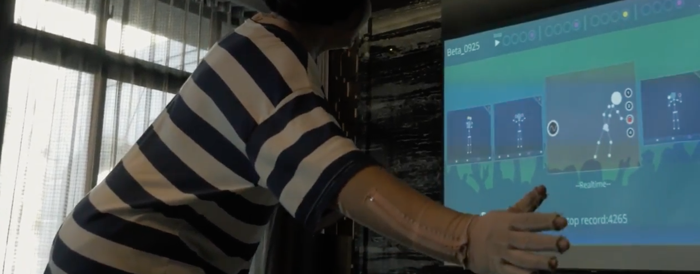
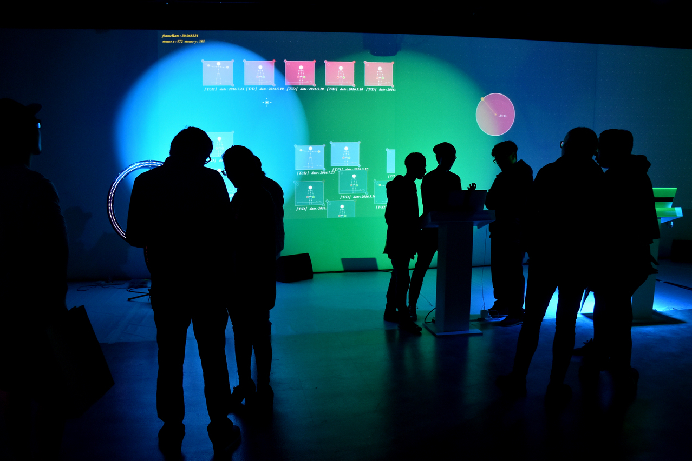
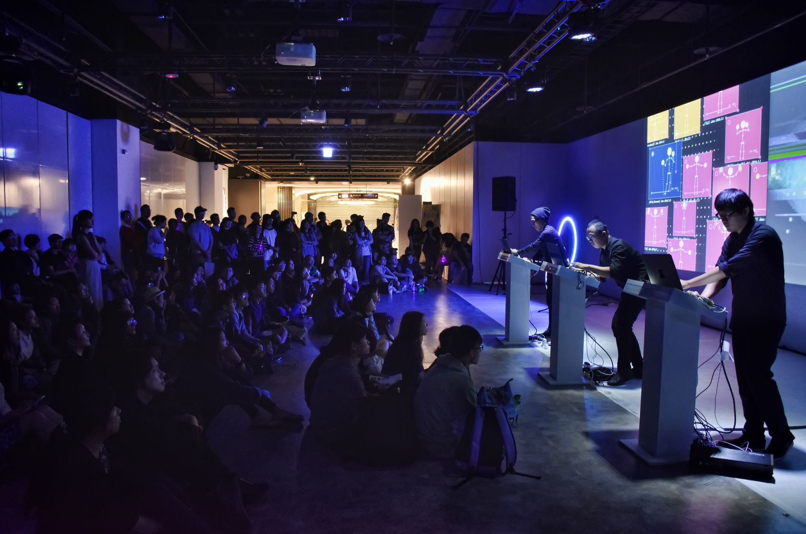
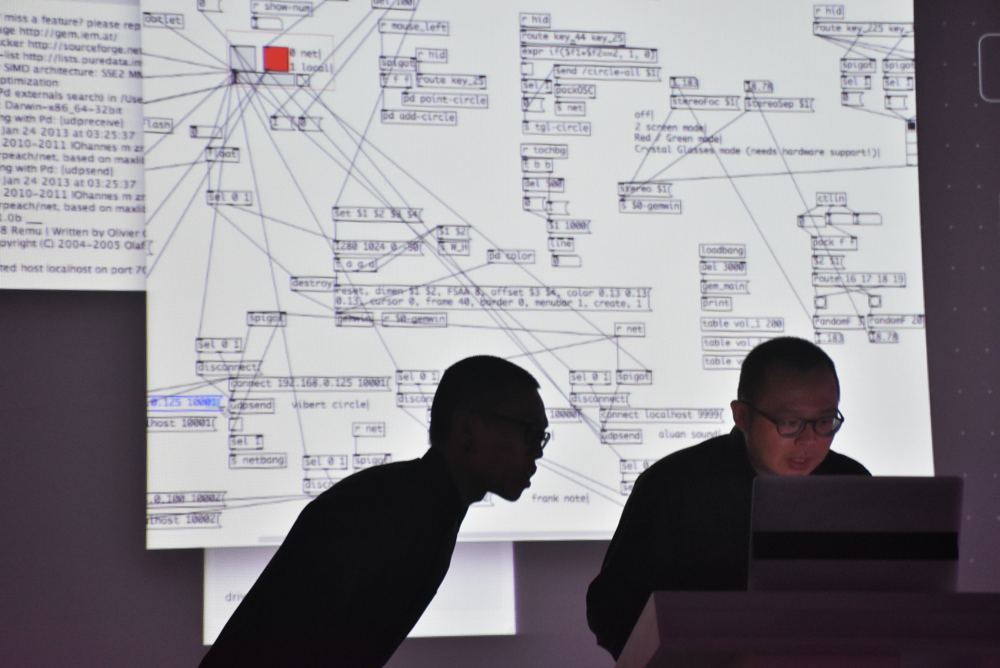

> 2016.9 – 2017.9

#####Rehabilitation + Art + Game + Performance, as a new approach of art therapy.

 

*One of the audience was playing the rehab-game
during the exhibition in Taipei. (2016.11)*

##Background

> 062720150832    484     15      44 %    18-29    ∞

These numbers represent an incident that shocked Taiwanese society—the Formosa Fun Coast explosion.

The incident happened at 8.32 pm. on June 27, 2015. Total injuries were 484 people, including 15 deaths, with 44 percent burns to their bodies. Most sadly, the victims were young people between the ages of 18 and 29. Many of the burn patients are still undergoing physical and psychological treatment.

##Healing through Art and Tech

Through this project, Aluan Wang and I aim to bring back a colorful future to young victims with music, art and technology. The patients not only have to keep up to the tempo of the game, but also are able to compose their own melodies using the application (music game) created by the digital artists. The application interacts with Kinect technology and engages in the process of rehabilitation. It detects the gesture of the player. If the movement of their body accords with the requirement of their therapy, the program will make a corresponding audio and visual feedback.

The addition of the music and creativity content in their rehabilitation aimed to bring a more positive atmosphere to them. The whole process was recorded so it could be repeated for the society. 

“Étude” is a French word, meaning the musical composition designed for practicing a certain skill. It’s a metaphor for rehabilitation procedures of the victims and the showcases of the artists.

 

*The patients were playing
the game during their rehabilitation. (2016.7)*

 

##Showcase

 

*After the performance, we were discussing with audience. (2016.11)*

Based on the users’ composing record, I extracted melody patterns and generated music from them by using live coding techniques, known as algorithmic rave. I performed as improvisers, creating live music and using their self-made instruments. The showcase acts as a platform that documents how these music therapy sessions find possibilities of rehabilitation and fine art.

 

*Étude Taipei Showcase. (2016.11)*

 

##Cooperation and Teamwork

This project was advised by Ministry of Culture of the Republic of China, sponsored by Quanta Computer. Hence, I had to not only design the system of data extraction and performance, but also coordinate with different artists and organizations.

I am the invited artist of this project, in charge of the design of the music game for procedures of rehabilitation, and the program composing the data of their recordings, in addition to the performance of the showcase.

 

##Links

[> Ars Electronica Festival 2017][1]  
[> Click Festival 2017][2]  
[> Showcase in Taipei 2016][3]  
[> Interview with The Patients][4]  
[> source code][5]  

[1]: https://www.aec.at/ai/en/etude/
[2]: http://www.clickfestival.dk/etude
[3]: https://www.youtube.com/watch?v=zU01cFDjL6s
[4]: https://www.youtube.com/watch?v=jnp93Dy3REY
[5]: https://github.com/vibertthio/etude
