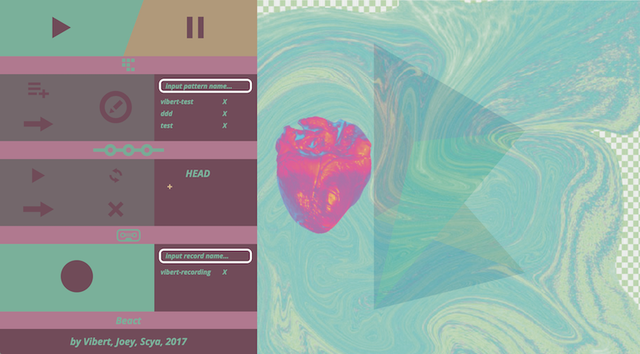

> 2017.4 – now

#####:guitar: :art: DJ and VJ all by yourself in seconds on a webpage! Use React to create beats. [  Play Now!](https://beacts.glitch.me/)

 

<!-- Copy and Paste Me -->

  <iframe
    allow="geolocation; microphone; camera; midi; encrypted-media"
    src="https://glitch.com/embed/#!/embed/beacts?path=README.md&previewSize=100&attributionHidden=true&previewFirst=true"
    alt="beacts on Glitch"
    style="height: 100%; width: 100%; border: 0;">
  </iframe>

##Introduction

It’s not only an audio/visual artwork but also an instrument that everyone can play with to become a DJ + VJ. Based on the idea of Patatap, “Beact” uses Two.js, Tone.js as audio and visual engine library respectively. It combines the concept of the sequencer with the keyboard, becoming a complete set for a musician to perform their work in a browser. This project merges creative coding into the software architecture with conceptual integrity.

##Inspiration

In my spare time, I followed some artists/hackers/musicians who utilize the browser and internet as media to create. Sometimes, I found works so astonishing that I couldn’t close mouth in front of my computer. The concept “Patatap” is really fascinating, that each letter corresponds to a sound and an animation. It transforms abstract words into a beautiful outcome.

After a while, I wanted to use it as an instrument for my performance and compose songs out of it. However, the system didn’t allow me to do that. I started thinking about modifying it. That’s the starting point of “Beact”.

*Screenshot of one scene of Beact. (2017.7)*

##Cooperation and Git

In the beginning, I developed “Beact” on my own. When I finished the front-end program which is the core logic of this project, I asked two of my friends, Yu-An Chan and Joey Huang, help me with the back-end and CSS respectively. I became the technical leader and project manager of the 3-person team and was in charge of all the front-end design, including visual and audio effects.

We used git as the version controlling tool. The size of the source code made the cooperation significantly hard and resulted in some conflicts difficult to resolve. I learned a lot about the workflow of git in this project and getting familiar with teamwork pattern in large-scale software engineering.

*Screenshot of other scenes of Beact. (2017.7)*

##Performer and Audience

There are several existing libraries which support audio or visual effects on node package manager (NPM). Therefore, I had to find the ones the most suitable for my project. I used React as the framework and Webpack as module bundler.

In beginning,  a user could only use the keyboard to access the functions. After a time, I added the connection port to a midi controller to let musicians play “Beact” with their own instruments. Thereafter, Beact is not merely a simple app for people to have fun with, but a powerful audio/visual tool that can be accessed with simply a browser for performers.

##Interactive Performance

I was so ambitious that I want to add more interactivity to Beact. Two weeks before the debut of Beact, I redesigned the server to let audience send a signal to the screen on stage during performances.

##UI/UX analysis

When I finished first the stable version of Beact and published it using Heroku, I got some feedback that some users felt not intuitional enough to use it without the text-based manual. I reached out for a friend Ms. Fang, who studies UI/UX in National Tsing Hua University in Taiwan. We are currently discussing how to make the UI/UX more friendly and instinctive in order to let users enjoy it without a manual.

*Screenshot of another scene of Beact. (2017.7)*

##Group Exhibition

In order to promote this project, I gathered few friends to hold a group exhibition to show our works, such as “Beact”, “Trail” (interactive light installation), etc. Moreover, I took charge of a workshop of creative coding and audio/visual art on the web to demonstrate the thriving community of artists, programmers, and makers on the internet. I also produced a teaser video for Beact, showing me using Beact to perform a bit.

 

<iframe src="https://player.vimeo.com/video/226318485" width="960" height="540" frameborder="0" webkitallowfullscreen mozallowfullscreen allowfullscreen></iframe>

<a href="https://vimeo.com/226318485">Beact | Web DJ / VJ | Teaser</a> from <a href="https://vimeo.com/user56788864">Vibert Thio</a> on <a href="https://vimeo.com">Vimeo</a>.

##Links

[> Beact][1] 
[> Showcase][2] 
[> Source Code][3] 
[> Blog][4]

[1]: https://beacts.glitch.me/
[2]: https://vimeo.com/226318485
[3]: https://github.com/vibertthio/beact
[4]: https://medium.com/@vibertthio/beact-audio-visual-art-in-react-44e9c757e40f
